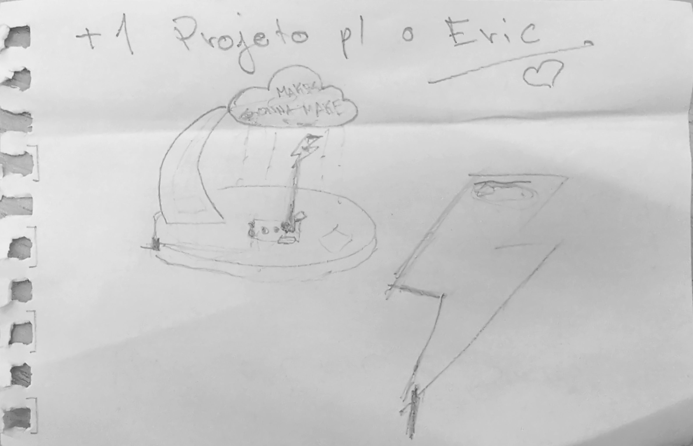
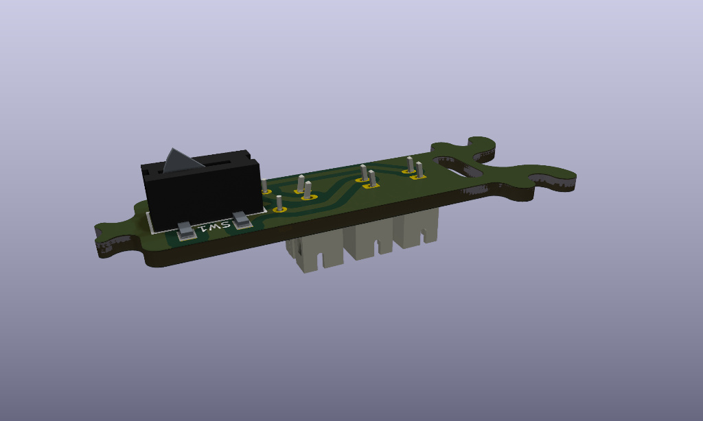

# Lâmpada Relâmpago — Kit Comemorativo 10 Anos Fab Lab Joinville

Uma versão curta e alegre do projeto: uma nuvem, um relâmpago e um pouco de mágica magnética.

_O esboço que eu e o Segui fizemos — foi assim que começou._

Como funciona (resumo):

- Ímãs se atraem e puxam a peça móvel.
- A PCB flexiona e aciona o switch (click!).
- LEDs tipo "string" acendem, iluminando a nuvem e o relâmpago.
O que tem aqui:

- Arquivos KiCad e gerbers para a PCB
- Vetores CNC para a base
- Modelos 3D para nuvem e relâmpago
Dicas rápidas:

- Verifique a profundidade do alojamento do switch se não houver clique.
- Teste os LEDs antes da montagem final.

Contribuições e melhorias são bem-vindas — faça brilhar! ✨
Licença: open-source (maker-friendly).
# Lâmpada Relâmpago — Kit Comemorativo 10 Anos Fab Lab Joinville

Parabéns — você encontrou um pedaço do trovão! Este repositório guarda tudo que você precisa para fabricar e montar a lâmpada relâmpago do aniversário de 10 anos do Fab Lab Joinville. É um presente que brilha, faz "click" e pode provocar sorrisos.

## Imagens (porque todo projeto merece glamour)

- Esboço do conceito: ./Docs/Scanned.jpg
- Render da placa: ./Docs/pcb_render.jpg

## Em poucas palavras (sem jargões chatos)

Imagine uma nuvem fofinha que guarda um segredo elétrico e um relâmpago que, quando aproximado, faz a nuvem piscar como se tivesse contado uma piada muito boa. Dois ímãs se apaixonam, a placa dá um suspiro elástico, o interruptor faz "click" e os LEDs dançam em azul.

Como funciona, versão curta e dramática:

1. Os ímãs da nuvem e do relâmpago se atraem (romance magnético).
2. A PCB flexiona levemente e ativa o switch (o gran finale do drama).
3. LEDs tipo "string" acendem, iluminando a nuvem e o relâmpago.

## O que vem no kit (ou nesta pasta)

- Arquivos KiCad e gerbers para a placa (PCB).
- Vetores para CNC da base de madeira.
- Modelos 3D para impressão da nuvem e do relâmpago.
- Documentação e imagens no diretório `Docs`.

## Ferramentas e materiais (a lista do faz-tudo)

- Fresadora CNC (para a base)
- Impressora 3D (para as peças decorativas)
- Estação de solda e estanho
- Ímãs de neodímio (pequenos, mas poderosos)
- Fios e conector JST para alimentação
- LEDs tipo "string" (azuis recomendados)

## Montagem — passo a passo para heróis e heroínas

1. Fresagem da base: corte o alojamento para o switch com cuidado para permitir o clique quando a PCB flexiona.
2. Monte a PCB: solde o switch detector (KFC-V-105-2), o conector JST e os fios dos LEDs.
3. Prenda os ímãs: cole nos locais indicados na nuvem e no relâmpago. Verifique a polaridade — a atração é essencial.
4. Teste rápido: ligue os LEDs antes de montar tudo para garantir que a fiação está certa.
5. Montagem final: encaixe a PCB na base, coloque a nuvem por cima e passe o relâmpago pela abertura.
6. Aproxime o relâmpago da nuvem — e voilà, faça seu pedido (ou só admire a luz).

## Créditos e agradecimentos

Obrigado ao Fab Lab Joinville pela inspiração e por deixar a imaginação virar protótipo. Projeto colaborativo — contribuições são bem-vindas!

## Licença

Open-source e maker-friendly. Compartilhe, modifique e faça brilhar — com amor e responsabilidade.

— Equipe Fab Lab Joinville
